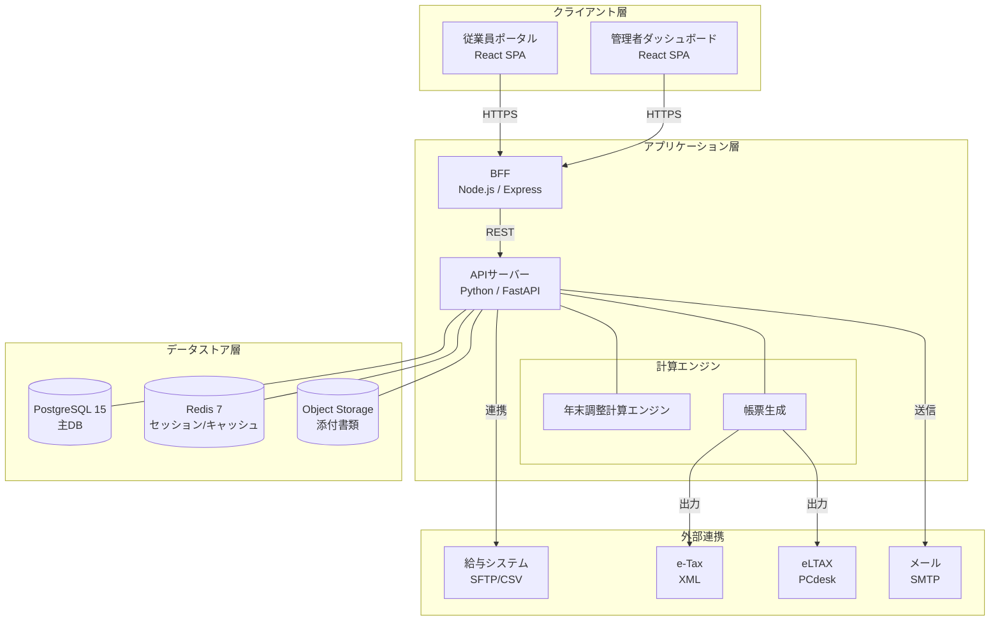
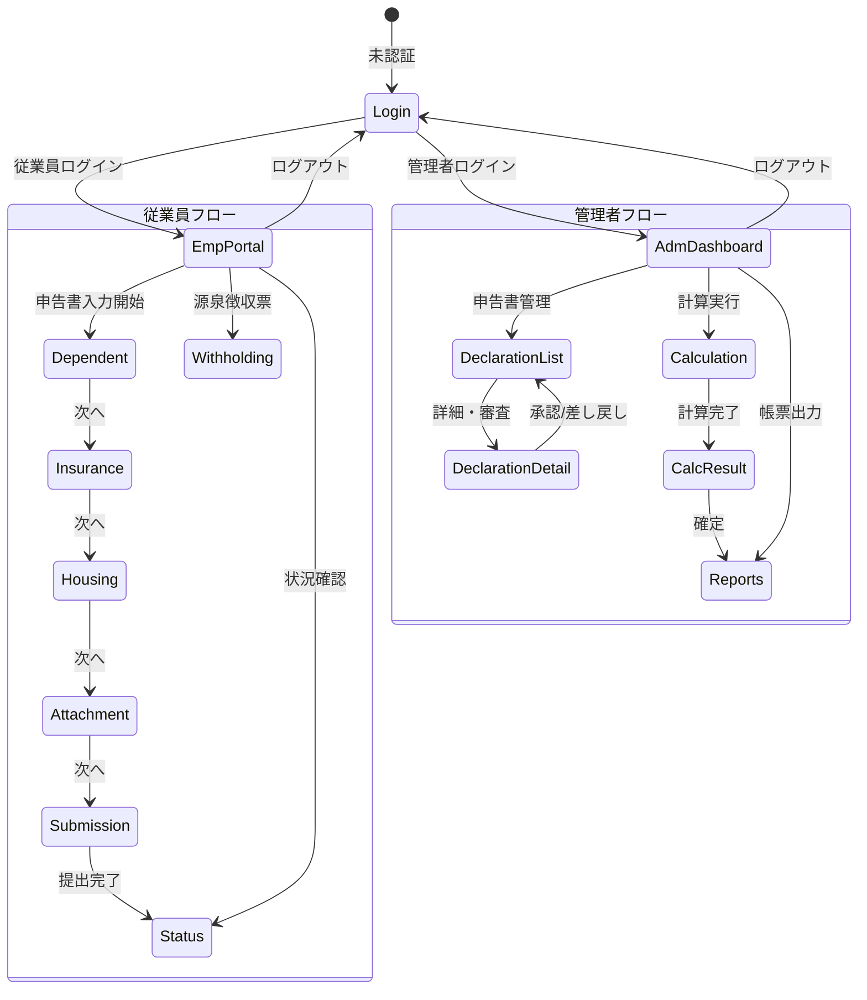
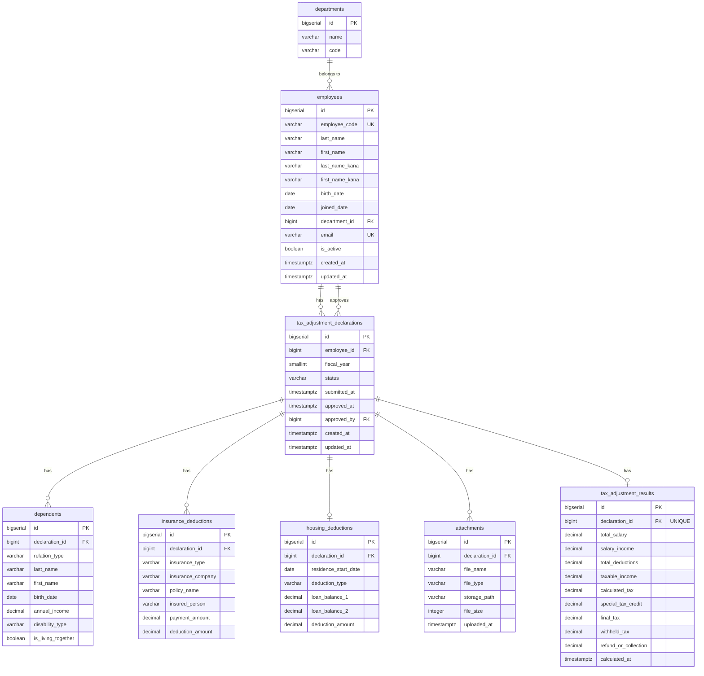
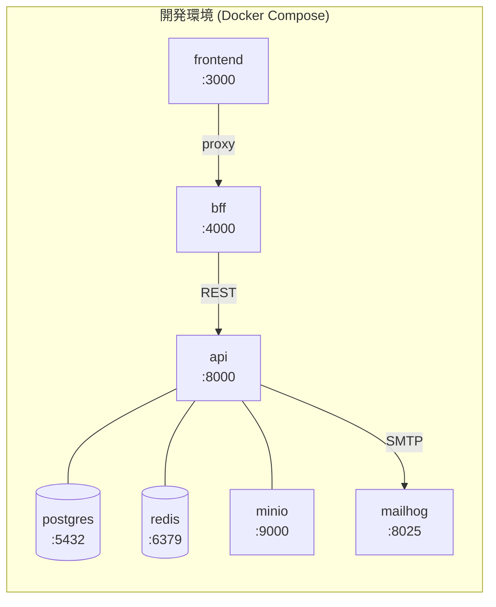
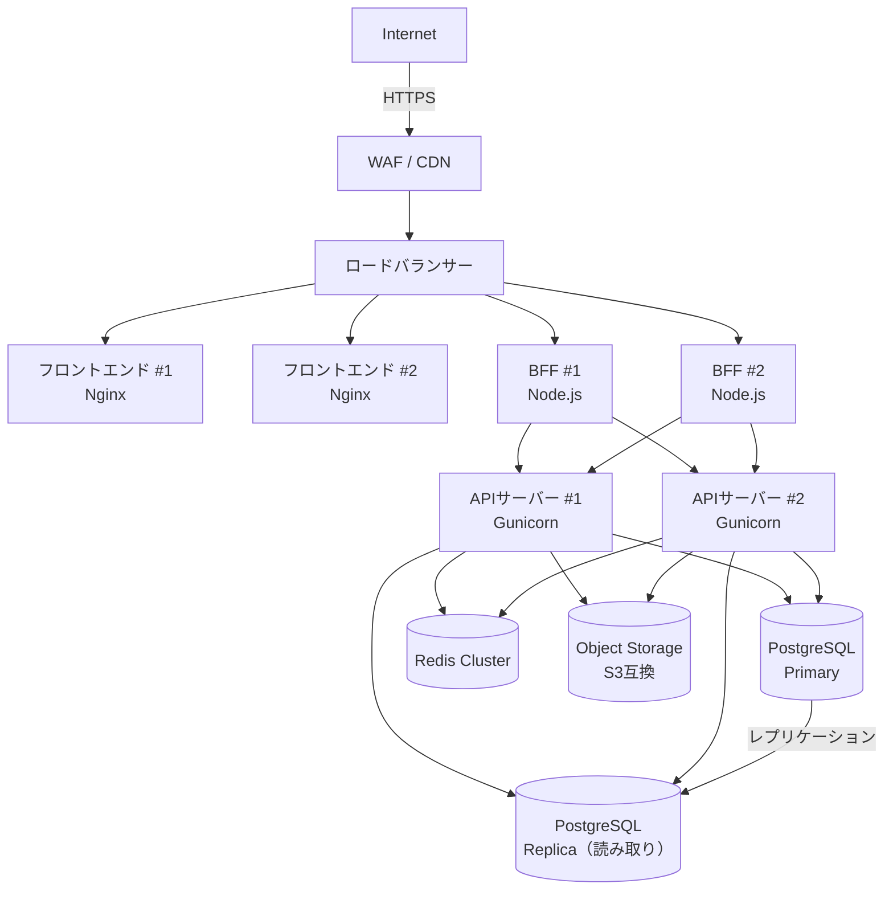
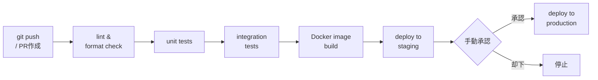
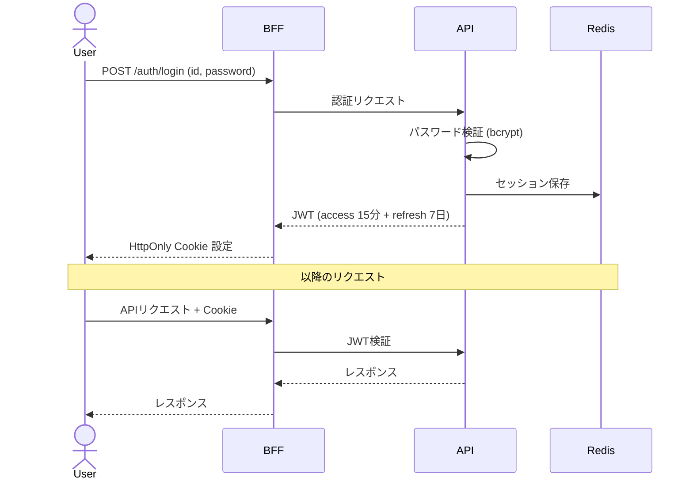

# 年末調整システム アーキテクチャ設計書

## 1. ドキュメント概要

| 項目 | 内容 |
|------|------|
| ドキュメント名 | 年末調整システム アーキテクチャ設計書 |
| バージョン | 1.0.0 |
| 作成日 | 2026-05-20 |
| 関連ドキュメント | システム仕様書 v1.0.0 |

---

## 2. システム全体アーキテクチャ

### 2.1 システム構成図



### 2.2 技術スタック

| レイヤー | 技術 | バージョン | 採用理由 |
|---------|------|-----------|---------|
| フロントエンド | React | 18.x | コンポーネント再利用性・エコシステム |
| フロントエンド | TypeScript | 5.x | 型安全性・開発効率 |
| フロントエンド | Vite | 5.x | 高速ビルド |
| BFF | Node.js / Express | 20.x LTS | 認証・セッション管理 |
| APIサーバー | Python / FastAPI | 3.12 / 0.11x | 計算処理・型安全なAPI定義 |
| DB | PostgreSQL | 15.x | 信頼性・トランザクション |
| キャッシュ | Redis | 7.x | セッション・一時データ |
| ファイルストレージ | MinIO（本番: S3互換） | Latest | 添付書類管理 |
| コンテナ | Docker / Docker Compose | 24.x | 環境統一 |
| CI/CD | GitHub Actions | — | 自動テスト・デプロイ |

---

## 3. フロントエンドアーキテクチャ

### 3.1 ディレクトリ構成

```
frontend/
├── public/
│   └── favicon.ico
├── src/
│   ├── assets/              # 静的リソース（画像・フォント）
│   ├── components/          # 共通UIコンポーネント
│   │   ├── common/
│   │   │   ├── Button/
│   │   │   ├── Form/
│   │   │   ├── Modal/
│   │   │   ├── Table/
│   │   │   └── Badge/
│   │   └── layout/
│   │       ├── Header/
│   │       ├── Sidebar/
│   │       └── PageLayout/
│   ├── features/            # 機能単位のモジュール
│   │   ├── auth/            # 認証（SCR-001）
│   │   ├── employee/        # 従業員ポータル
│   │   │   ├── portal/      # SCR-010
│   │   │   ├── dependent/   # SCR-011
│   │   │   ├── insurance/   # SCR-012
│   │   │   ├── housing/     # SCR-013
│   │   │   ├── attachment/  # SCR-014
│   │   │   ├── submission/  # SCR-015
│   │   │   ├── status/      # SCR-016
│   │   │   └── withholding/ # SCR-017
│   │   └── admin/           # 管理者画面
│   │       ├── dashboard/   # SCR-100
│   │       ├── declarations/ # SCR-101, SCR-102
│   │       ├── calculation/ # SCR-103, SCR-104
│   │       └── reports/     # SCR-105
│   ├── hooks/               # カスタムフック
│   ├── lib/                 # ユーティリティ・API クライアント
│   │   ├── api/
│   │   └── utils/
│   ├── stores/              # 状態管理（Zustand）
│   ├── types/               # 型定義
│   ├── router/              # ルーティング設定
│   ├── App.tsx
│   └── main.tsx
├── index.html
├── package.json
├── tsconfig.json
└── vite.config.ts
```

### 3.2 状態管理

| 対象 | 手段 | 理由 |
|------|------|------|
| サーバー状態（API データ） | TanStack Query | キャッシュ・再取得・楽観的更新 |
| クライアント状態 | Zustand | 軽量・シンプル |
| フォーム状態 | React Hook Form | 高パフォーマンス・バリデーション |
| セッション | Cookie（HttpOnly） | XSS対策 |

### 3.3 画面遷移図



### 3.4 ルーティング設計

```
/login                     → SCR-001: ログイン
/employee/
  portal                   → SCR-010: 従業員ポータルトップ
  declaration/
    dependent              → SCR-011: 扶養控除等申告書
    insurance              → SCR-012: 保険料控除申告書
    housing                → SCR-013: 住宅借入金等特別控除申告書
    attachment             → SCR-014: 添付書類アップロード
    confirm                → SCR-015: 確認・提出
  status                   → SCR-016: 提出状況確認
  withholding-slip         → SCR-017: 源泉徴収票閲覧
/admin/
  dashboard                → SCR-100: 管理者ダッシュボード
  declarations             → SCR-101: 申告書一覧
  declarations/:id         → SCR-102: 申告書詳細・審査
  calculation              → SCR-103: 年末調整計算実行
  calculation/results      → SCR-104: 計算結果確認
  reports                  → SCR-105: 帳票出力
```

---

## 4. バックエンドアーキテクチャ

### 4.1 ディレクトリ構成

```
backend/
├── app/
│   ├── api/
│   │   └── v1/
│   │       ├── routers/
│   │       │   ├── auth.py
│   │       │   ├── employees.py
│   │       │   ├── declarations.py
│   │       │   ├── dependents.py
│   │       │   ├── insurance.py
│   │       │   ├── housing.py
│   │       │   ├── attachments.py
│   │       │   ├── calculation.py
│   │       │   ├── results.py
│   │       │   └── reports.py
│   │       └── dependencies.py
│   ├── core/
│   │   ├── config.py
│   │   ├── security.py
│   │   └── exceptions.py
│   ├── domain/
│   │   ├── models/
│   │   ├── services/
│   │   │   ├── tax_calculation/
│   │   │   │   ├── salary_income.py
│   │   │   │   ├── insurance_deduction.py
│   │   │   │   ├── housing_deduction.py
│   │   │   │   └── tax_engine.py
│   │   │   ├── declaration_service.py
│   │   │   ├── notification_service.py
│   │   │   └── report_service.py
│   │   └── repositories/
│   ├── infrastructure/
│   │   ├── database/
│   │   │   ├── models.py
│   │   │   ├── session.py
│   │   │   └── migrations/
│   │   ├── repositories/
│   │   ├── storage/
│   │   └── external/
│   │       ├── payroll_system.py
│   │       ├── etax.py
│   │       └── eltax.py
│   └── main.py
├── tests/
│   ├── unit/
│   ├── integration/
│   └── e2e/
├── pyproject.toml
└── Dockerfile
```

### 4.2 API 設計

#### 認証

| メソッド | エンドポイント | 説明 |
|---------|--------------|------|
| POST | `/api/v1/auth/login` | ログイン |
| POST | `/api/v1/auth/logout` | ログアウト |
| POST | `/api/v1/auth/refresh` | トークンリフレッシュ |

#### 申告書管理

| メソッド | エンドポイント | 説明 |
|---------|--------------|------|
| GET | `/api/v1/declarations` | 申告書一覧取得 |
| POST | `/api/v1/declarations` | 申告書作成 |
| GET | `/api/v1/declarations/{id}` | 申告書詳細取得 |
| PATCH | `/api/v1/declarations/{id}` | 申告書更新 |
| POST | `/api/v1/declarations/{id}/submit` | 申告書提出 |
| POST | `/api/v1/declarations/{id}/approve` | 申告書承認 |
| POST | `/api/v1/declarations/{id}/reject` | 申告書差し戻し |

#### 年末調整計算

| メソッド | エンドポイント | 説明 |
|---------|--------------|------|
| POST | `/api/v1/calculations/run` | 年末調整計算実行 |
| GET | `/api/v1/calculations/results` | 計算結果一覧 |
| POST | `/api/v1/calculations/confirm` | 計算結果確定 |

#### 帳票出力

| メソッド | エンドポイント | 説明 |
|---------|--------------|------|
| GET | `/api/v1/reports/withholding-slip/{id}` | 源泉徴収票PDF取得 |
| POST | `/api/v1/reports/withholding-slip/batch` | 源泉徴収票一括生成 |
| GET | `/api/v1/reports/legal-summary` | 法定調書合計表出力 |
| GET | `/api/v1/reports/salary-report` | 給与支払報告書出力 |

### 4.3 年末調整計算エンジン

```mermaid
classDiagram
    class TaxCalculationEngine {
        +run(declaration_id) Result
    }
    class SalaryIncomeCalculator {
        +calculate(total_salary) salary_income
    }
    class BasicDeductionCalculator {
        +calculate(salary_income) deduction
    }
    class SpouseDeductionCalculator {
        +calculate(spouse_income) deduction
    }
    class DependentDeductionCalculator {
        +calculate(dependents) deduction
    }
    class InsuranceDeductionCalculator {
        +calculate(insurance_list) deduction
        -calcLifeInsurance(amount) int
        -calcMedicalCare(amount) int
        -calcAnnuity(amount) int
        -calcEarthquake(amount) int
    }
    class HousingDeductionCalculator {
        +calculate(loan_balance) deduction
    }
    class IncomeTaxCalculator {
        +calculate(taxable_income) tax
    }
    class RevivalTaxCalculator {
        +calculate(income_tax) revival_tax
    }

    TaxCalculationEngine --> SalaryIncomeCalculator
    TaxCalculationEngine --> BasicDeductionCalculator
    TaxCalculationEngine --> SpouseDeductionCalculator
    TaxCalculationEngine --> DependentDeductionCalculator
    TaxCalculationEngine --> InsuranceDeductionCalculator
    TaxCalculationEngine --> HousingDeductionCalculator
    TaxCalculationEngine --> IncomeTaxCalculator
    TaxCalculationEngine --> RevivalTaxCalculator
```



---

## 5. データベース設計

### 5.1 ER 図



### 5.2 インデックス設計

| テーブル | インデックス | 目的 |
|---------|------------|------|
| employees | `employee_code` | 社員番号検索 |
| employees | `email` | メール検索・一意制約 |
| tax_adjustment_declarations | `(employee_id, fiscal_year)` | 従業員×年度検索（UNIQUE） |
| tax_adjustment_declarations | `status` | ステータスフィルタリング |
| tax_adjustment_declarations | `submitted_at` | 提出日ソート |

---

## 6. インフラ構成

### 6.1 開発環境（Docker Compose）



### 6.2 本番環境構成



### 6.3 CI/CD パイプライン



---

## 7. セキュリティ設計

### 7.1 認証フロー



### 7.2 認証・認可

| 項目 | 実装方針 |
|------|---------|
| 認証方式 | JWT（アクセストークン15分 + リフレッシュトークン7日） |
| セッション管理 | Redis（HttpOnly Cookie） |
| パスワード | bcrypt（コスト係数12） |
| ロールベースアクセス制御 | 従業員（employee） / 管理者（admin） |

### 7.3 データ保護

- 全通信 TLS 1.2以上を強制（HSTS設定）
- CSP（Content-Security-Policy）ヘッダー設定
- DB 保存データ: AES-256 暗号化（個人情報カラム）
- ファイルストレージ: サーバーサイド暗号化
- ログ: 個人情報のマスキング処理

---

## 8. ログ・監視設計

### 8.1 ログ設計

| ログ種別 | 出力先 | 保管期間 | 内容 |
|---------|--------|---------|------|
| アプリケーションログ | ファイル → 集約サーバー | 5年 | INFO/WARNING/ERROR |
| アクセスログ | ファイル → 集約サーバー | 5年 | リクエスト・レスポンス |
| 個人情報アクセスログ | DB | 5年 | 誰がいつ何を参照したか |
| 計算実行ログ | DB | 7年 | 年末調整計算の入出力 |

### 8.2 監視項目

| 監視項目 | 閾値 | アクション |
|---------|------|----------|
| APIレスポンスタイム | 3秒超 | アラート |
| エラーレート | 1%超 | アラート |
| DB接続数 | 80%超 | アラート |
| ディスク使用率 | 80%超 | アラート |
| 計算処理キュー長 | 100件超 | アラート |

---

## 9. 改訂履歴

| バージョン | 改訂日 | 改訂者 | 改訂内容 |
|-----------|--------|--------|---------|
| 1.0.0 | 2026-05-20 | システム開発チーム | 初版作成 |
